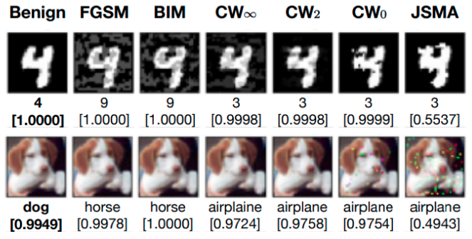

<div style="text-align:center"></div>

Deep neural networks (DNNs) have demonstrated impressive performance on many challenging machine learning tasks. However, DNNs are vulnerable to adversarial inputs generated by adding maliciously crafted perturbations to the benign inputs. As a growing number of attacks have been reported to generate adversarial inputs of varying sophistication, the defense-attack arms race has been accelerated.

This project offers the following features to facilitate the development of adversarial attacks and defenses:
1. It supports ten state-of-the-art attack algorithms with easy-to-use interfaces.
2. It includes two benchmark datasets (MNIST and CIFAR-10) with their pretrained target models that are widely used in research (7-layer CNN for MNIST and DenseNet40 for CIFAR-10).
3. It offers a simple interface to generate attack targets systematically.
4. It keeps track of the progress of generating adversarial examples.

## Installation and Dependencies
This project runs on Python 3.6. You are highly recommended to create a virtual environment to make sure the dependencies do not interfere with your current programming environment. By default, GPUs will be used to accelerate the process of adversarial attacks. 

To install related packages, run the following command in terminal:
```bash
pip install -r requirements.txt
```

## Supported Attacks
Ten attacks are supported in the current version. The details can be found under the `attacks` directory. Below shows the list of attack functions you can invoke and their default hyperparameters.

| Attack Function                  | Default Parameters                                                                                                                                                                                |
|----------------------------------|---------------------------------------------------------------------------------------------------------------------------------------------------------------------------------------------------|
| Attack_FastGradientMethod        | eps=0.3                                                                                                                                                                                           |
| Attack_BasicIterativeMethod      | eps=0.3, eps_iter=0.03, nb_iter=40                                                                                                                                                                |
| Attack_ProjectedGradientDescent  | eps=0.3, eps_iter=0.03, nb_iter=40                                                                                                                                                                |
| Attack_DeepFool                  | overshoot=10.0, max_iter=50                                                                                                                                                                       |
| Attack_CarliniL2                 | confidence=0, max_iterations=10000, learning_rate=1e-2, binary_search_steps=9, initial_const=1e-3, abort_early=True, targeted=True                                                                |
| Attack_CarliniLi                 | confidence=0, max_iterations=1000, learning_rate=5e-3, initial_const=1e-5, largest_const=2e+1, reduce_const=False, decrease_factor=0.9, const_factor=2.0, abort_early=True, targeted=True         |
| Attack_CarliniL0                 | confidence=.01, max_iterations=1000, learning_rate=1e-2, independent_channels=False, initial_const=1e-3, largest_const=2e6, reduce_const=False, const_factor=2.0, abort_early=True, targeted=True |
| Attack_JacobianSaliencyMapMethod | theta=1.0, gamma=0.1                                                                                                                                                                              |
| Attack_EADL1                     | confidence=0, max_iterations=10000, learning_rate=1e-2, binary_search_steps=9, initial_const=1e-3, abort_early=True, beta=1e-3, targeted=True                                                     |
| Attack_EADEN                     | confidence=0, max_iterations=10000, learning_rate=1e-2, binary_search_steps=9, initial_const=1e-3, abort_early=True, beta=1e-3, targeted=True                                                     |

## Content
This section provides a guideline to use this project. Scripts for generating adversarial examples for MNIST and CIFAR10 can be found in the folders `attack_scripts`. It can be divided into three parts: (i) selecting test images and generating their attack targets, (ii) generating adversarial examples, and (iii) evaluating the generated adversarial examples. More details can be found in the source code.

Before generating the test set, we load the MNISTDataset `dataset` that contains the entire training (60,000 images) and test sets (10,000 images). We include a 7-layer CNN `model` trained to classify the handwritten digits in the MNIST dataset as the victim to be attacked. 
```bash
dataset = MNISTDataset()
model = MNIST_carlini()
```

### (i) Selecting test images and generating attack targets
Adversarial attacks can be an expensive process and one may only select a subset of images for experimental studies. The helper function `get_data_subset_with_systematic_attack_labels` selects the first `num_examples` images from the entire test set that can be correctly classified by the target model. If balanced is set to be `True`, the same number of images will be selected from each class.

This function also generate attack targets systematically which will be used in targeted attacks. The supported targets are
1. Most-likely (ML) targets: For each selected test image, we take the class label with the second largest confidence predicted by the target model.
2. Least-likely (LL) targets: For each selected test image, we take the class label with the lowest confidence predicted by the target model.
```bash
X_test, Y_test, Y_test_target_ml, Y_test_target_ll = get_data_subset_with_systematic_attack_labels(
    dataset=dataset, model=model, balanced=True, num_examples=100
)
```

### (ii) Generate adversarial examples
We can easily launch any supported attack by providing the hyperparameters (e.g., the maximum perturbation `eps` in the FastGradientMethod). Then, the `attack(model, X_test, Y_test)` function generates adversarial examples. Note that for targeted attacks, `Y_test` is the attack targets while for untargeted attacks, `Y_test` is the true class labels.
```bash
fgsm = Attack_FastGradientMethod(eps=0.3)
X_test_adv = fgsm.attack(model, X_test, Y_test)
```

### (iii) Evaluate the generated adversarial examples
After generating adversarial examples, we provide a simple interface to generate some statistics to evaluate attacks, which can be done easily with the following function. It provides the misclassification rate, attack success rate, mean confidence on successful adversarial examples, and distortion measured in three different norms.
```bash
evaluate_adversarial_examples(X_test=X_test, Y_test=Y_test,
                              X_test_adv=X_test_adv, Y_test_adv_pred=model.predict(X_test_adv),
                              Y_test_target=Y_test, targeted=False)
```

After running the above, you will see the following:
```bash
Loading the dataset...
Evaluating the target model...
Test accuracy on benign examples 99.43%
Mean confidence on ground truth classes 99.39%
Selected 100 examples.
Test accuracy on selected benign examples 100.00%
Mean confidence on ground truth classes, selected 100.00%

---Statistics of FGSM Attack (0.002426 seconds per sample)
Success rate: 46.00%, Misclassification rate: 46.00%, Mean confidence: 94.97%
Li dist: 0.3020, L2 dist: 5.9213, L0 dist: 56.2%
```

## Status
We are continuing the development and there is ongoing work in our lab regarding adversarial attacks and defenses. If you would like to contribute to this project, please contact [Ka-Ho Chow](https://khchow.com). 

The code is provided as is, without warranty or support. If you use our code, please cite:
```
@inproceedings{chow2019denoising,
  title={Denoising and Verification Cross-Layer Ensemble Against Black-box Adversarial Attacks," IEEE International Conference on Big Data},
  author={Chow, Ka-Ho and Wei, Wenqi and Wu, Yanzhao and Liu, Ling},
  booktitle={Proceedings of the 2019 IEEE International Conference on Big Data},
  year={2019},
  organization={IEEE}
}
```
